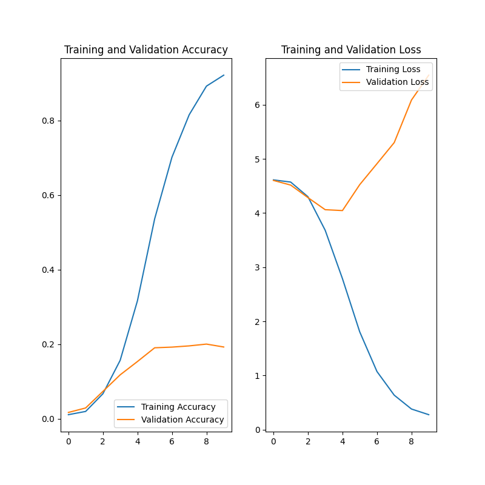
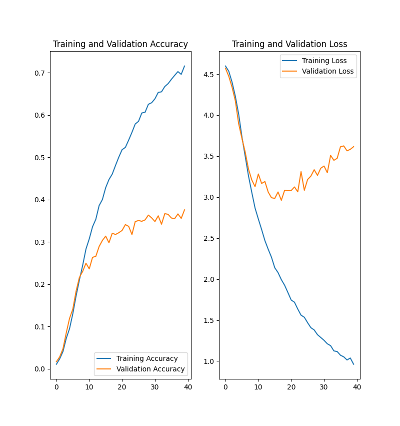
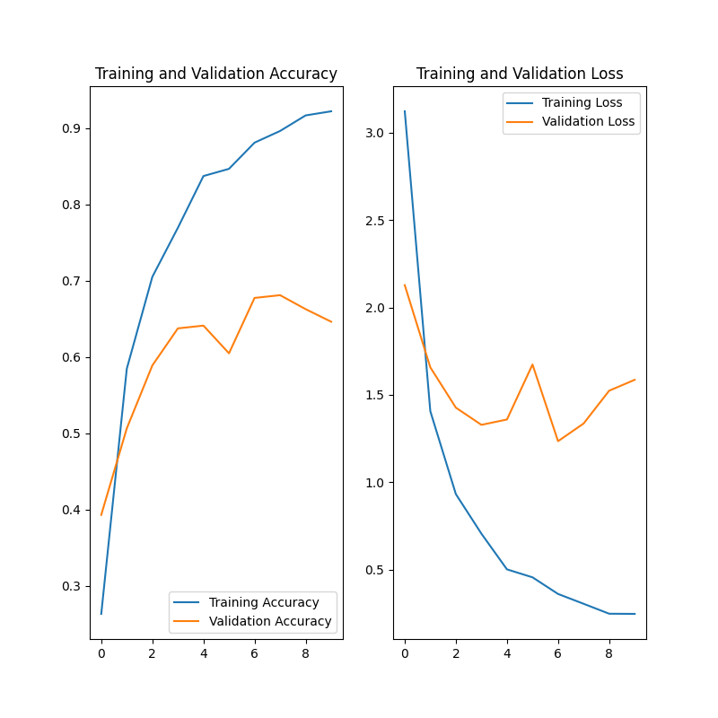

# airplane-recognition

## About the project

The project's goal is to develop a desktop application that uses a CNN model to determine the model of an airplane from 
a picture. I'll use the FGVC-Aircraft dataset (https://www.robots.ox.ac.uk/vgg/data/fgvc-aircraft/) as my dataset, 
which has 10000 photos separated into 100 classes.

## Results so far

By far, I was unable to get satisfactory prediction outcomes. I attempted to develop the CNN on my own as well as use 
common architectures such as AlexNet, EfficientNet, and MobileNet.

* Results of the first CNN (v0.1)

* Results of the modified CNN (v0.2)

* Results of the EfficientNetB0 with imagenet weights

## Summary

The project is presently on hold due to the difficulties in developing a decent Neural Network capable of handling this dataset.

### Packages and versions used

* Python 3.9
* CUDA v11.2
* cuDNN v8.1.0
* TensorFlow (Keras) 2.9.0